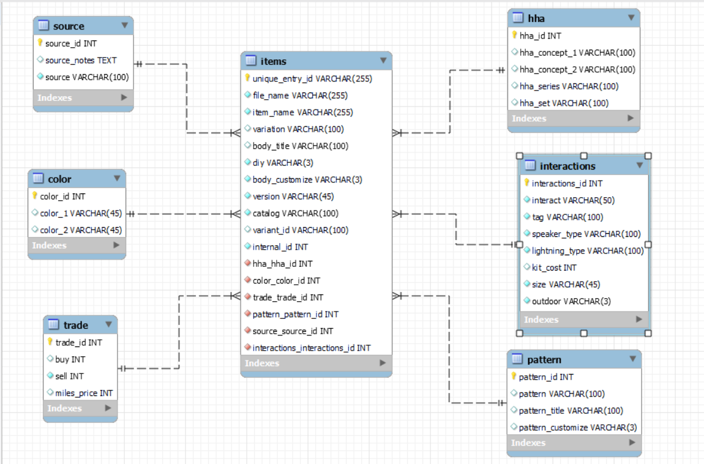

# Animal-Crossing-New-Horizons-Housewares-Database

Welcome to the ACNH Housewares Database project! This database is designed to store and manage item information from the popular Nintendo Switch game Animal Crossing: New Horizons. Below you will find details on the purpose of the project, how the data is structured, how to set up the database, and how to run sample queries.7

- [Overview](#overview)
- [Database Schema](#database-schema)
- [Entity-Relationship Diagram](#entity-relationship-diagram)
- [Data Sources](#data-sources)
- [Setup and Installation](#setup-and-installation)
- [Usage and Queries](#usage-and-queries)
- [Stored Procedures and Views](#stored-procedures-and-views)
- [Potential Issues and Considerations](#potential-issues-and-considerations)

## Overview
**Project Goal**
The main goal of this project is to develop a relational database for Animal Crossing: New Horizons houseware items. We aim to store item data with relevant properties, such as color variations, purchase/sell prices, size, customization options, and more. This makes it easy to query, analyze, and maintain detailed information about in-game items.

**Why ACNH Housewares?**
Animal Crossing: New Horizons (ACNH) features a vast catalog of items, many of which have multiple variations (color, pattern, style) and different in-game mechanics (DIY, HHA themes, etc.). A well-designed database helps fans and researchers:

- Quickly search for items by name, color, or variation.
- Identify items that are customizable or DIY-craftable.
- Track purchasing and selling prices.
- Understand relationships between items (e.g., HHA concepts and sets).

## Database Schema (3NF Design)

The database follows a Third Normal Form (3NF) design to reduce redundancy and improve data integrity. The main tables are:

- **items**
  - **Description:** Stores core item information (name, variation, body title, version, customization flags, unique IDs, etc.).
  - **Key Fields:**
    - `unique_entry_id`: Unique identifier for each item.
    - `internal_id`: Internal numeric identifier.
    - `variation`
    - `diy`: Indicates whether it can be crafted or not.
    - `body_customize` & `pattern_customize`
    - `catalog`: Sale availability.
    - `source_source_id`: Links to the source table.

- **trade**
  - **Description:** Holds financial aspects of items.
  - **Key Fields:**
    - `trade_id`: Primary key.
    - `buy`: Purchase cost.
    - `sell`: Sell price.
    - `miles_price`: Nook Miles cost if applicable.

- **color**
  - **Description:** Manages color information for items.
  - **Key Fields:**
    - `color_id`: Primary key.
    - `color_name`: e.g., Red, Blue, Beige.

- **interactions**
  - **Description:** Handles item interaction details.
  - **Key Fields:**
    - `interactions_id`: Primary key.
    - `speaker_type`: e.g., Hi-Fi, Retro, “Does not play music.”
    - `lighting_type`: e.g., Candle, Spotlight.
    - `outdoor`: Indicates if an item is for outdoor use.
    - `size`: Grid size in the game.

- **pattern**
  - **Description:** Stores pattern information for items.
  - **Key Fields:**
    - `pattern_id`: Primary key.
    - `pattern_title`: e.g., Navy design, Blue stripes.

- **hha**
  - **Description:** Contains Happy Home Academy (HHA) classifications.
  - **Key Fields:**
    - `hha_id`: Primary key.
    - `hha_concept_1` / `hha_concept_2`: e.g., living room, kitchen.
    - `hha_series`: e.g., Wooden, Frozen.
    - `hha_set`: e.g., bear, birthday.

- **source**
  - **Description:** Details where an item can be obtained (e.g., Nook’s Cranny, Crafting, Gulliver’s Gift).
  - **Key Fields:**
    - `source_id`: Primary key.
    - `source`: The source name.
    - `source_notes`: Explanations or extra details.

**Relationships:**
- `items` references `source` via `source_source_id`.
- `items` can reference `color`, `pattern`, `hha`, etc., through linking tables or direct foreign keys.
- `trade` typically references `items` or uses a common key to associate financial info.
- `interactions` references `items` for interactive properties.

## Entity-Relationship Diagram
Below is a simplified ER diagram for the database.



## Data Sources
- **Kaggle Dataset**
The primary dataset for houseware items comes from [Kaggle’s ACNH Nook Plaza dataset](https://www.kaggle.com/datasets/jessicali9530/animal-crossing-new-horizons-nookplaza-dataset).
- **User-Contributed Data**
Additional data (e.g., new versions, special items) can be contributed by the community and merged into the existing schema.

# Setup and Installation
- **Requirements**
  - MySQL Server (8.0 or higher recommended)
  - MySQL Workbench (for schema design and queries)
  - A CSV parser or Python (Pandas) scripts to load data.Stores core item information (name, variation, body title, version, customization flags, unique IDs, etc.).
- **Create the Database**
  - Open MySQL Workbench or your preferred MySQL client.
  - Create a new schema (e.g., CREATE DATABASE acnh_housewares; USE acnh_housewares;).
- **Run the SQL Script**
  - Use the provided SQL script (or the statements in this repository) to create all tables:
  ```sql
    CREATE TABLE source (
      source_id INT NOT NULL AUTO_INCREMENT,
      source VARCHAR(100) NOT NULL,
      source_notes TEXT,
      PRIMARY KEY (source_id)
    );

    -- Repeat for other tables: items, color, trade, interactions, pattern, hha...

  ```
- **Load Data**
  - Once the tables are created, load CSV data using LOAD DATA INFILE commands or Python scripts:
  ```sql
    LOAD DATA INFILE 'C:\\path\\to\\source.csv'
    INTO TABLE source
    FIELDS TERMINATED BY ','
    LINES TERMINATED BY '\n'
    (source, source_notes);
  ```
  - Repeat for other tables (items, color, trade, etc.) as needed.
  - Make sure to set the correct file paths and character set.

## Usage and Queries
After successfully loading the data, you can start querying the database. Below are some example queries:
- **Minimum "buy" price in the trade table**
  ```sql
    SELECT MIN(buy) AS min_buy
    FROM trade;

  ```
- **Count unique entries in items table & find minimum "buy"**
  ```sql
    SELECT COUNT(DISTINCT unique_entry_id) AS unique_item_count,
       MIN(t.buy) AS min_buy
    FROM items i
    JOIN trade t ON i.internal_id = t.trade_id; -- or appropriate join key
  ```
- **Minimum "kit_cost" for items in a specific "catalog"**
  ```sql
    SELECT MIN(kit_cost) AS min_kit_cost
    FROM items
    WHERE catalog = 'For sale'; -- Example condition

  ```
- **Maximum "sell" and minimum "buy" in trade**
  ```sql
    SELECT MAX(sell) AS max_sell,
       MIN(buy) AS min_buy
    FROM trade;
  ```
- **Count of DIY items in items**
  ```sql
    SELECT COUNT(*) AS diy_count
    FROM items
    WHERE diy = 'Yes';
  ```
More sample queries are included in the documentation or SQL script.

## Stored Procedures and Views

### Stored Procedures

#### countColorsById(colorName, @colorcount)
- **Purpose:**  
  Returns how many items exist with a given color.
- **Usage:**
  ```sql
  SET @colorcount = 0;
  CALL countColorsById('Beige', @colorcount);
  SELECT @colorcount;
  ```
#### selectPropertiesBySpeakerType(@var)
- **Purpose:**  
  Lists properties for items matching a given speaker_type, then changes the variable to a new value.
- **Usage:**
  ```sql
  SET @var = 'Does not play music';
  CALL selectPropertiesBySpeakerType(@var);
  ```
#### getVariation(variation)
- **Purpose:**  
  Prints all items that have a specified variation value.
- **Usage:**
  ```sql
  CALL getVariation('Black');
  ```
#### Views
- **Example View:**
  ```sql
    CREATE VIEW baby_chairs AS SELECT * FROM items WHERE item_name LIKE '%baby chair%';
  ```  
- **Usage:**
   ```sql
    SELECT * FROM baby_chairs;
  ```   
## Potential Issues and Considerations
- **Performance**
  - Large datasets may cause slow queries. Regularly analyze and optimize indexes to ensure quick lookups.
- **Normalization**
  - The database has been normalized to 3NF, reducing redundancy. However, ensure new data remains consistent with this design.
- **Complex Queries**
  - Some queries involving multiple joins (e.g., color, pattern, hha, trade) can become complex. Use indexing and break down queries if necessary.
- **Data Integrity**
  - Maintaining accurate relationships (especially with many-to-many linking tables) requires careful handling of foreign keys and constraints.


## End of the README

Feel free to explore each step in detail, modify, and extend this project for your own research or fan-related activities. If you have questions or suggestions, please open an issue or submit a pull request.
- **Email:** [catsudeebrar@gmail.com](mail)
